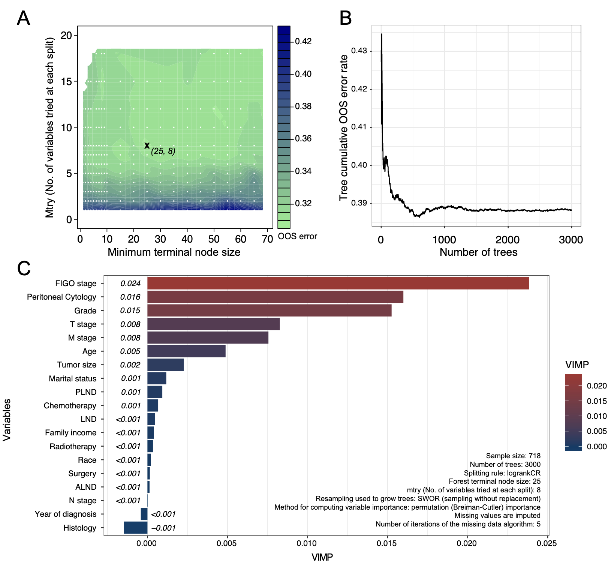
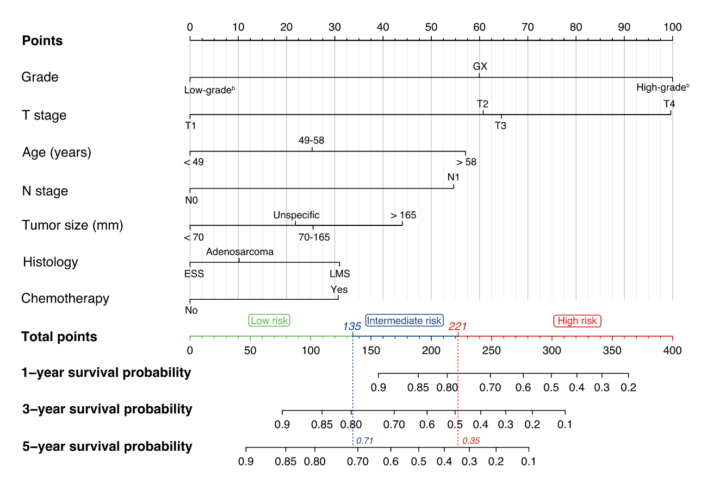
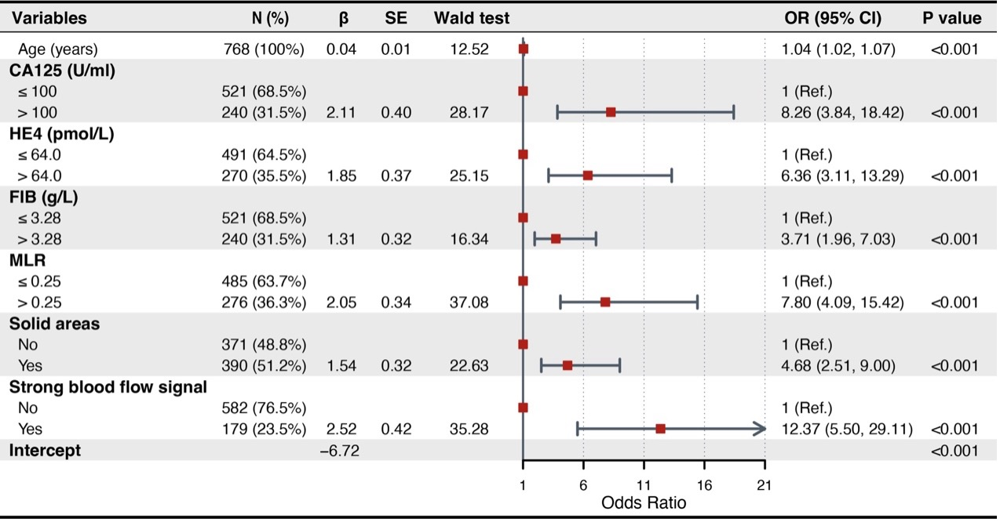
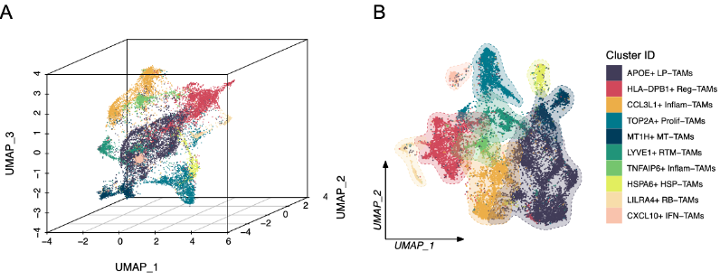

# GMPT代码仓库
杜俊宏
2025-03-28

本代码仓库包含了[GMPT（Gynecologic Malignancies Prediction
Toolkit）](https://lzudjh.shinyapps.io/gmpt/ "GMPT")的所有源代码。目前GMPT涵盖了子宫肉瘤预后预测模型、子宫肉瘤放疗辅助决策工具，以及基于炎症标志物的卵巢肿瘤恶性风险评估工具和基于CCL3L1+
Inflam-TAMs相关预后基因签名（MRPGS）的卵巢癌预后预测模型。

GMPT的构建基于了大规模人群数据、临床病例分析及单细胞测序，从多维度探讨了腹膜细胞学、辅助放疗及炎症反应标志物对子宫肉瘤及卵巢癌预后的影响，并构建了一系列高效预测模型。揭示了恶性腹膜细胞学对子宫肉瘤的独立预后价值，并开发了可指导放疗决策的风险分层系统。基于炎症标志物的列线图模型和基于CCL3L1+
Inflam-TAMs相关基因的综合预后模型为卵巢癌恶性风险评估和预后预测提供了新的选择。最后，整合所有模型的GMPT网页应用实现了临床转化，其开源方法学为个体化治疗策略制定和预后评估提供了标准化工具。

在构建GMPT过程，我们编写并测试了包括多维度变量筛选、随机生存森林建模、单细胞数据处理管线、预测模型的HTML编译和网页部署等过程的代码，并在此对其进行完全开源。我们期望该开源项目能够为其他临床医学同道针对子宫肉瘤和卵巢癌等妇科恶性肿瘤的进一步研究提供一定的代码编写上的帮助和方法学参考。GMPT网页应用及本代码仓库将长期维护，未来我们将不断完善GMPT网站以涵盖更多妇科恶性肿瘤类型及预测工具，真正实现妇科恶性肿瘤的一站式预测。

------------------------------------------------------------------------

- GMPT网站：<https://lzudjh.shinyapps.io/gmpt/>

- GMPT桌面端应用（目前仅支持macOS）：<https://github.com/djhcod/GMPT_code/releases>

- 本地部署GMPT（完整下载所有文件后通过RStudio运行）：<https://github.com/djhcod/GMPT_code/tree/main/web_nomogram>

- 本项目截至目前已发表研究成果（SCI）：

  - Du J, Hu D, Xing Y, et al. Correlation between malignant peritoneal
    cytology and survival in patients with uterine leiomyosarcoma and
    endometrial stromal sarcoma\[J\]. International Journal of
    Gynecologic Cancer, 2024, 34(1): 58-65. DOI:
    [10.1136/ijgc-2023-004792](https://doi.org/10.1136/ijgc-2023-004792).

  - Du J, Cheng Y, Hu D, et al. A nomogram-based overall survival
    stratification to identify uterine sarcoma patients without distant
    metastases who may benefit from adjuvant radiotherapy\[J\].
    Gynecologic Oncology, 2023, 169: 17-26. DOI:
    [10.1016/j.ygyno.2022.11.023](https://doi.org/10.1016/j.ygyno.2022.11.023).

------------------------------------------------------------------------

# 各模型简述

## 基于腹膜细胞学状态的子宫肉瘤预后预测模型

恶性腹膜细胞学（malignant peritoneal
cytology）是指腹腔和/或盆腔腹膜及其积液中出现恶性肿瘤细胞，已被证明是与多种妇科恶性肿瘤的不良预后相关的重要预后因素。在子宫肉瘤，尤其是晚期疾病中，恶性腹膜细胞学的检出率也较高，然而由于这种恶性肿瘤的相对罕见性以及腹膜细胞学检查尚未成为这类患者的常规术中报告项目，导致目前为止少有针对腹膜细胞学对子宫肉瘤患者预后影响的研究。

因此，本研究利用监测、流行病学和最终结果（Surveillance, Epidemiology,
and End
Result，SEER）数据，通过基于多重插补数据集的倾向性评分匹配（propensity
score
matching，PSM）平衡良恶性腹膜细胞学患者间的基线特征，以评估腹膜细胞学对子宫肉瘤预后的独立影响。结果发现，恶性腹膜细胞学与子宫平滑肌肉瘤和子宫内膜间质肉瘤患者倾向性评分匹配后5年总生存（overall
survival，OS）率下降17.7%和中位生存时间缩短13个月具有统计学相关性。在对混杂因素进行调整后，恶性腹膜细胞学被证明为子宫平滑肌肉瘤和子宫内膜间质肉瘤患者的独立预后危险因素。进一步通过随机生存森林（random
survival
forest，RSF）分析证明了腹膜细胞学对预测子宫平滑肌肉瘤和间质肉瘤患者OS的重要意义，在所分析的所有临床病理变量中，是仅次于FIGO分期的关键预后预测因素。随后，多个亚组分析结果表明，在倾向性评分匹配前后，恶性腹膜细胞学与大多数亚组的不良
OS相关，进一步证实了研究结果的稳健性。

最后，基于腹膜细胞学状态构建了一个子宫肉瘤患者的预后预测模型，通过时间依赖受试者工作特性（receiver
operating characteristic，ROC）曲线、校准曲线和决策曲线分析（decision
curve analysis，DCA）等工具证明了该模型具有较好的预测性能。

💡本模型的对应源代码位于“[sarcoma_peri](https://github.com/djhcod/GMPT_code/tree/main/sarcoma_peri)”文件夹内。

> 通过随机生存森林（RSF）分析确定子宫平滑肌肉瘤和子宫内膜间质肉瘤的关键预后因素。来源：[Du
> J, Hu D, Xing Y, et al. Correlation between malignant peritoneal
> cytology and survival in patients with uterine leiomyosarcoma and
> endometrial stromal sarcoma\[J\]. International Journal of Gynecologic
> Cancer, 2024, 34(1): 58-65.](https://doi.org/10.1136/ijgc-2023-004792)

## 子宫肉瘤放疗辅助决策工具

辅助放疗对子宫肉瘤患者预后的作用，尤其是对OS的影响仍不明确，此前的回顾性研究和随机对照临床试验的结果存在较大差异。因此，为了识别能够从辅助放疗中获益的无远处转移的子宫肉瘤患者，本研究利用SEER数据，基于稳定逆处理概率加权（stabilized
inverse probability of treatment
weighting，sIPTW）平衡放疗和未放疗患者间的基线特征，以评估辅助放疗对子宫肉瘤预后的独立影响。通过LASSO-Cox回归筛选与子宫肉瘤患者预后显著相关的关键人口统计学和临床病理学变量。关键变量通过多因素Cox回归建模并构建列线图用于估计子宫肉瘤患者的1年、3年和5年OS。该模型在预测子宫肉瘤患者的预后时显示了良好的区分度和校准能力。最后，通过基于递归分割法的决策树分析构建子宫肉瘤预后风险分层系统。该预后分层系统能够将子宫肉瘤患者分为三个风险组，三组患者的预后存在显著差异，高危组患者可从辅助放疗中获得显著的OS改善，而低危和中危患者无法从辅助放疗中获得显著的OS改善。

💡本模型的对应源代码位于“[sarcoma_rad](https://github.com/djhcod/GMPT_code/tree/main/sarcoma_rad)”文件夹内。

> 子宫肉瘤患者预后列线图。来源：[Du J, Cheng Y, Hu D, et al. A
> nomogram-based overall survival stratification to identify uterine
> sarcoma patients without distant metastases who may benefit from
> adjuvant radiotherapy\[J\]. Gynecologic Oncology, 2023, 169:
> 17-26.](https://doi.org/10.1016/j.ygyno.2022.11.023)

## 基于全身炎症反应标志物的卵巢肿块恶性风险评估工具

该部分研究纳入了1087名因卵巢肿瘤接受手术治疗的患者，计算全身炎症反应指标，基于LASSO-logistic回归方法识别出能有效区分卵巢良恶性肿块的预测因子。基于全身炎症反应标记物、血清肿瘤标记物、超声特征和人口统计学变量建立了三个不同等级的模型（Model
1-3）。通过计算ΔAUC、NRI和IDI证明了Model
3中两个炎症指标，即纤维蛋白原（fibrinogen，FIB）和单核-淋巴细胞比值（monocyte-to-lymphocyte
ratio，MLR）的加入能显著提高模型区分良恶性卵巢肿块的准确性。最后，基于Model
3构建了一个列线图预测模型，并证明其与RMI、LR2、ROMA、CPH-I和R-OPS模型相比，在预测卵巢恶性肿瘤和识别早期卵巢癌方面具有更高的准确度。

💡本模型的对应源代码位于“[inflammatory_markers](https://github.com/djhcod/GMPT_code/tree/main/inflammatory_markers)”文件夹内。

> 多因素Cox回归模型。

## 基于炎症标志物的卵巢肿瘤恶性风险评估工具和基于CCL3L1+ Inflam-TAMs相关预后基因签名（MRPGS）的卵巢癌预后预测模型

该部分研究进一步利用单细胞RNA测序（scRNA-seq）数据针对卵巢肿瘤恶性风险评估工具纳入的MLR中的单核-巨噬细胞系统进行进一步分子水平的建模。通过整合多个卵巢癌高质量单细胞测序数据，执行基于Seurat管线的质控、标准化、降维、聚类、分群和注释等流程，对卵巢癌肿瘤相关巨噬细胞（tumor-associated
macrophages,
TAMs）进行分子分型，并通过对TCGA数据的去卷积分析建立各亚型细胞比例和卵巢癌预后的关联。结果发现CCL3L1+
Inflam-TAMs是对卵巢癌预后预测有重要贡献的关键巨噬细胞亚群。因此，基于CCL3L1+
Inflam-TAMs相关基因通过训练随机生存森林构建了一个预后评分（MRPGS），并结合MRPGS和其他临床变量构建了最终的综合模型，该模型在对卵巢癌患者进行预后预测时表现出较高的准确性。

> 各巨噬细胞亚群完成生物学注释后的UMAP聚类图。

## GMPT的搭建

为了进一步提升本研究所构建的各个预测模型及分层系统的实际使用的便捷性和直观性，利用Shiny工具（version
1.9.1，<https://shiny.posit.co>），这一基于R的网络应用框架对所有模型及分层系统进行了HTML编译，将其整合并转换成了网页预测工具——Gynecologic
Malignancies Prediction
Toolkit（GMPT）。随后，通过shinyapps.io（<https://www.shinyapps.io>）公共服务器进行了网站部署。此外，进一步利用基于Rust
Tauri框架的Pake（version
3.1.1，<https://github.com/tw93/Pake>）开发工具将其打包为macOS桌面级应用程序，以适配更多工作环境。

💡GMPT网页应用对应源代码位于“[web_nomogram](https://github.com/djhcod/GMPT_code/tree/main/web_nomogram)”文件夹内。完整下载该文件夹后可在RStudio本地运行GMPT应用。
